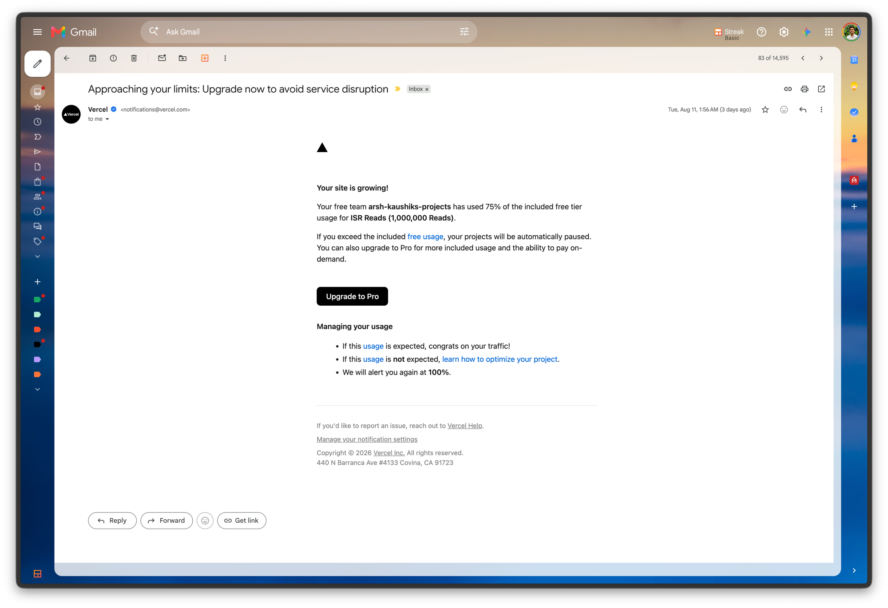
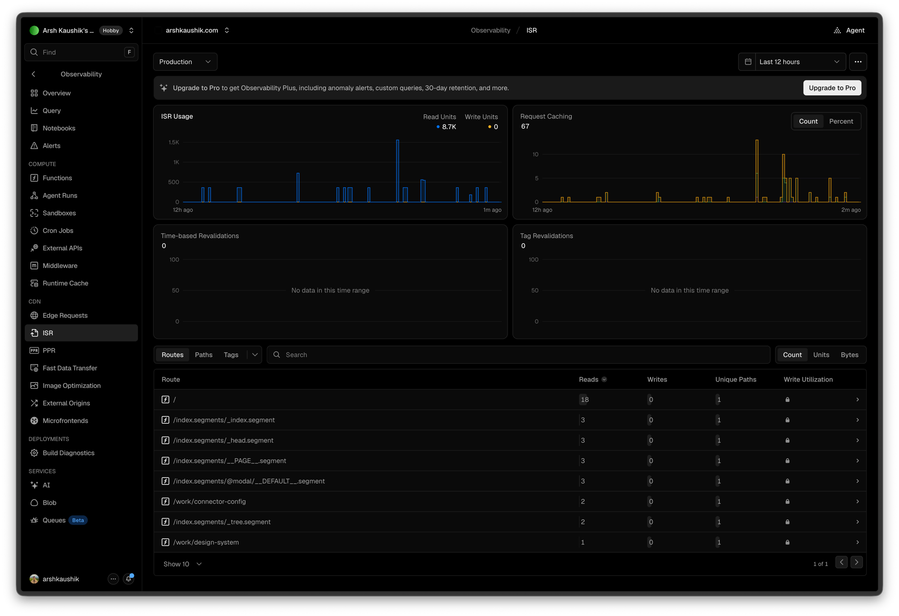
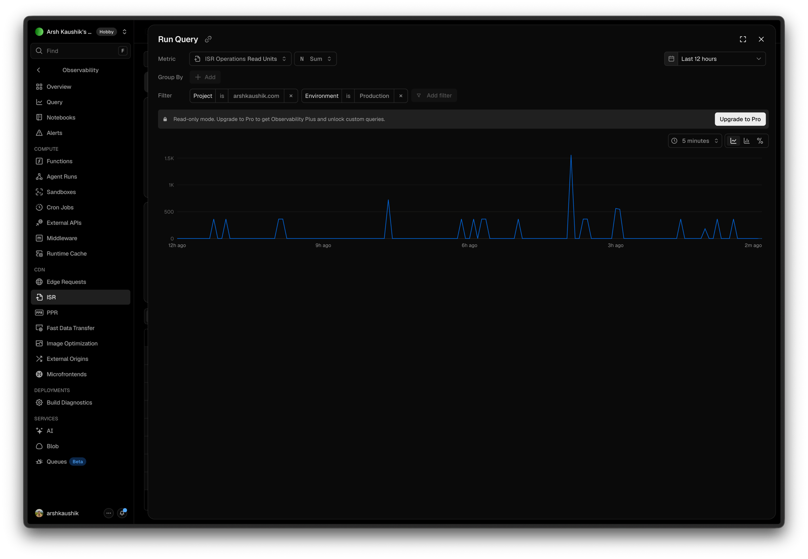
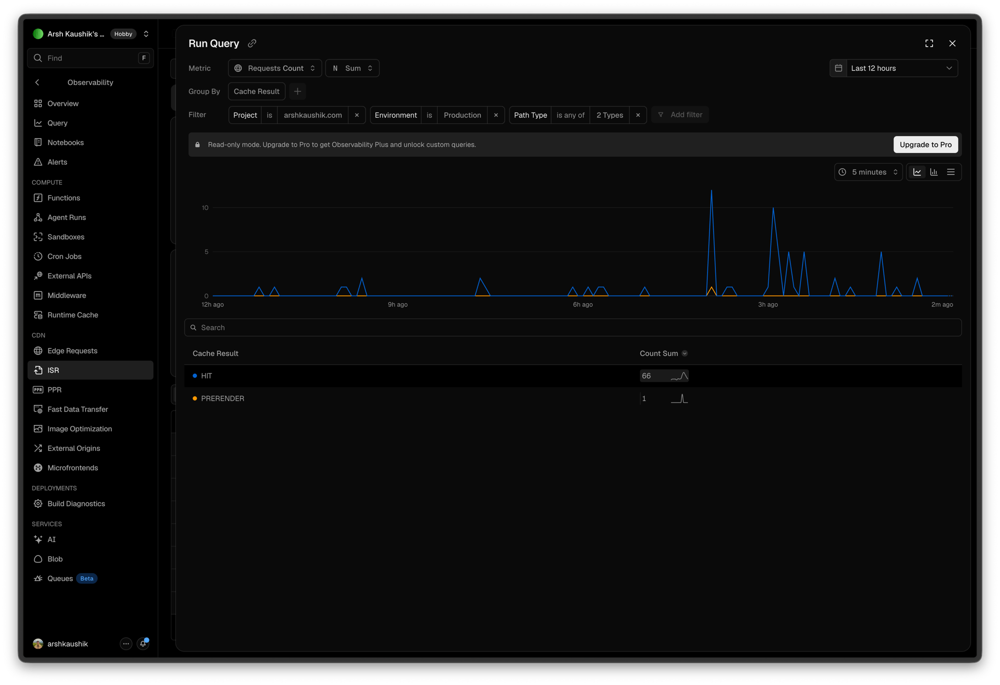

# The Vercel ISR Quota Blowout — Why 2,000 Visits Nearly Took the Site Offline

The story of an email that said the site had used **75% of a 1,000,000-request
free tier** — on a portfolio with **fewer than 10 real visitors in five days**.

The alarming part wasn't the number. It was that the number was *correct*, and
that the cause had nothing to do with traffic. It was the thumbnails — and
specifically, the decision (documented in `svg-thumbnail-blur.md` §10) to embed
them into the HTML as inline `<svg>` for visual quality.

**The one-line version:** a Vercel "ISR read" is not one page view — it is one
**8 KB block of data**. The home page was 2,833 KB of HTML, so every single
request for it cost **354 reads instead of ~2**.

The fix replaced inline SVG with a plain `` pointing at one WebP file per
study. Home-page HTML went **2,833 KB → 30 KB**, and ISR reads per request went
**354 → 3**.

---

## Contents

1. [The email](#1-the-email)
2. [What ISR actually is, in plain English](#2-what-isr-actually-is-in-plain-english)
3. [What "Request Caching" means — the three cache layers](#3-what-request-caching-means--the-three-cache-layers)
4. [Reading the dashboard](#4-reading-the-dashboard)
5. [The diagnosis: an ISR read is not a page view](#5-the-diagnosis-an-isr-read-is-not-a-page-view)
6. [Why the page was 2.8 MB — the hidden second copy](#6-why-the-page-was-28-mb--the-hidden-second-copy)
7. [Why *low* traffic made it worse](#7-why-low-traffic-made-it-worse)
8. [Two confident wrong answers](#8-two-confident-wrong-answers)
9. [The fix](#9-the-fix)
10. [Why not a size ladder, and why not `next/image`](#10-why-not-a-size-ladder-and-why-not-nextimage)
11. [Verification, and a false alarm](#11-verification-and-a-false-alarm)
12. [Results](#12-results)
13. [Lessons](#13-lessons)

---

## 1. The email



From `notifications@vercel.com`, **Tue 11 Aug 2026, 1:56 AM**, subject line
*"Approaching your limits: Upgrade now to avoid service disruption"*:

> **Your site is growing!**
>
> Your free team **arsh-kaushiks-projects** has used 75% of the included free
> tier usage for **ISR Reads (1,000,000 Reads)**.
>
> If you exceed the included free usage, your projects will be automatically
> paused. […] We will alert you again at **100%**.

Two things made this worth investigating rather than shrugging at:

- **"Automatically paused" means the site goes offline.** Not throttled, not
  billed — paused. That's the actual stake.
- **The traffic didn't exist.** Analytics showed fewer than 10 visitors across
  five days. A portfolio with no traffic should not be approaching a
  million-anything.

So either the meter was wrong, or "ISR Reads" did not mean what it sounded like.
It was the second one.

---

## 2. What ISR actually is, in plain English

**ISR = Incremental Static Regeneration.** Two separate ideas got welded into one
name, and only one of them applied here.

Instead of building a page fresh every time somebody visits, Next.js builds the
pages **once, at deploy time**, and stores the finished HTML. That's faster and
cheaper than rendering per request. But the finished HTML has to live *somewhere*
that servers around the world can fetch it from — and that storage is the
**ISR cache**.

The *"Regeneration"* half means those stored pages can be rebuilt later, either
on a timer (`revalidate: 60`) or on demand (`revalidateTag`). **This site has
never used that.** There is no `revalidate` anywhere in the project.

Here's the part that surprises everyone:

> You are not billed for regenerating pages. You are billed for **reading your
> pages back out of that storage** — and the meter counts **data volume, in 8 KB
> blocks**.

So pages that are built once and never change still cost money to serve, and a
big page costs proportionally more than a small one. Nothing was misconfigured.
The pages were simply enormous.

---

## 3. What "Request Caching" means — the three cache layers

The other unfamiliar term on the dashboard. There are three layers between a
visitor and the site, and Vercel checks them in order, stopping at the first one
that can answer:

| Layer | Where it lives | Cost |
|---|---|---|
| **1. CDN cache** | ~300 edge locations worldwide | **Free** |
| **2. ISR cache** | One single region | **Billed**, in 8 KB units |
| **3. The function** | Runs only if both caches miss | Billed as compute |

**Request Caching** is simply the panel telling you *which layer answered*. The
values worth knowing:

- `HIT` — served from cache, no function ran
- `PRERENDER` — served a prerendered ISR page
- `MISS` — nothing had it; the function ran
- `STALE` — served the old copy while refreshing in the background
- `BYPASS` — caching deliberately skipped (e.g. an SEO crawler, draft mode)

A high proportion of `HIT`/`PRERENDER` is the healthy outcome — and this site had
that. Which is exactly why the bill was confusing: caching was working *fine*.
The problem was the **size** of what was being cached, not the hit rate.

---

## 4. Reading the dashboard

Vercel → project → **Observability → ISR**, Production, last 12 hours.



> **Two readings, three days apart.** The dashboard was checked at diagnosis
> (11 Aug) and again while writing this up (14 Aug, which is what the screenshots
> show). Both are given below, because the fact that the pattern held steady
> across three days is itself part of the evidence — this was not a one-off spike.

| Panel | 11 Aug | **14 Aug (screenshots)** | What it told us |
|---|---|---|---|
| ISR Usage — **Read Units** | 7.8K | **8.7K** | 12 hours of billed reads |
| ISR Usage — **Write Units** | 0 | **0** | Nothing is ever regenerated |
| **Request Caching** | 33 | **67** | Sixty-seven requests. Total. |
| **Time-based Revalidations** | 0 | **0** | No `revalidate` intervals firing |
| **Tag Revalidations** | 0 | **0** | No on-demand invalidation either |

The per-route breakdown from the 14 Aug screenshot — note this column is a
**count of operations**, not units:

| Route | Reads | Writes | Unique paths |
|---|---|---|---|
| `/` | **18** | 0 | 1 |
| `/index.segments/_index.segment` | 3 | 0 | 1 |
| `/index.segments/_head.segment` | 3 | 0 | 1 |
| `/index.segments/__PAGE__.segment` | 3 | 0 | 1 |
| `/index.segments/@modal/__DEFAULT__.segment` | 3 | 0 | 1 |
| `/work/connector-config` | 2 | 0 | 1 |
| `/index.segments/_tree.segment` | 2 | 0 | 1 |
| `/work/design-system` | 1 | 0 | 1 |
| **Total** | **35** | **0** | |

**35 read operations produced 8,700 read units.** That ratio — about 250 units per
single read — is the entire mystery, solved in one number. (The 11 Aug reading was
28 operations → 7,800 units, i.e. ~280 per read. Same story.)

### The read-units graph



`Metric: ISR Operations Read Units · Sum · Last 12 hours`, 5-minute buckets.

The shape mattered as much as the height. Most spikes are **flat at ~354–380** —
one request for the home page each — evenly spaced across all twelve hours
including overnight, mostly isolated single events. The taller ones are simply
several requests landing in the same 5-minute bucket (~700 = two, ~1.55K ≈ four).

That is not human browsing; humans cluster and view more than one page. It's
crawlers, AI scrapers and link-preview bots. (`robots.ts` allows
`userAgent: "*"`, so every bot on the internet is invited.)

And **354 is not an arbitrary number** — see §5.

### The cache-result graph



`Metric: Requests Count · Sum · grouped by Cache Result`, filtered to Production
and two path types.

- `HIT` — **66**
- `PRERENDER` — **1**

Sixty-seven requests in twelve hours, essentially all served from cache. Caching
was healthy. The site was just heavy.

> **Note on the Hobby plan:** both query panels show *"Read-only mode. Upgrade to
> Pro to get Observability Plus and unlock custom queries."* You can read the
> built-in metrics and change the metric/grouping, but not save custom queries.
> Retention is also shorter. Everything above was obtainable without upgrading.

---

## 5. The diagnosis: an ISR read is not a page view

An ISR read is **one 8 KB block of data**. So the cost of serving a page is:

```
read units  =  page size in bytes  ÷  8192
```

Measured from the production build at the time:

| Page | Raw HTML | ÷ 8 KB = reads per request |
|---|---|---|
| `/` | 2,833 KB | **354** |
| `/work/design-system` | 3,528 KB | **441** |
| `/work/command-line` | 3,437 KB | **429** |
| `/work/connector-config` | 4,378 KB | **547** |
| *a typical portfolio page* | *~50 KB* | *~6* |

There it is: **354**, exactly the height of the ordinary spikes on the graph. Each
one was a single bot fetching the home page.

### Reconciling the whole dashboard from page sizes alone

Worth doing in full, because it's what turned a theory into a certainty. Taking
the 14 Aug route counts and multiplying each by that route's measured size:

| Route | Reads | × units each | = units |
|---|---|---|---|
| `/` | 18 | 354 | 6,372 |
| `/work/connector-config` | 2 | 547 | 1,094 |
| `/work/design-system` | 1 | 441 | 441 |
| `/index.segments/__PAGE__.segment` | 3 | 174 *(1,395 KB `.rsc`)* | 522 |
| `_index` / `_head` / `_tree` / `@modal` segments | 11 | ~0 *(0–3 KB each)* | ~0 |
| **Predicted total** | | | **≈ 8,429** |
| **Dashboard reported** | | | **8,700** |

Within **3%** — from nothing but `stat` on four built HTML files. Two consequences
fell straight out:

- **The tiny segment files are free; the big pages are everything.** Eleven of the
  35 operations contributed essentially zero units. Four page reads contributed 92%
  of the bill.
- **Vercel meters the *raw* size, not the gzipped size.** Visitors downloaded
  548 KB (gzipped); the meter charged for 2,833 KB. That 5× gap is why the page
  never *felt* as heavy as it was billed.

Extrapolated: ~8K units per 12 hours ≈ **480–520K/month**. The site was on track
to be paused roughly every six to seven weeks, forever, on no traffic — and the
75% warning had already arrived.

---

## 6. Why the page was 2.8 MB — the hidden second copy

The three SVG masters are not individually large:

| File | Size |
|---|---|
| `commandLine.svg` | 292 KB |
| `designSystem.svg` | 337 KB |
| `connectorConfig.svg` | 758 KB |
| **Total** | **1,388 KB** |

*(For the record: Figma's **raw** SVG exports are ~973 KB each. These are the
SVGO-optimised versions — about 70% smaller. Comparing a raw Figma export to a
Figma PNG export is an apples-to-oranges trap worth avoiding.)*

Two multipliers turned 1,388 KB into 2,833 KB.

**Multiplier 1 — all three land on the same page.** The home page shows all three
cards at once, so it contains all three SVGs simultaneously. Before anything
else, that's ~30× a normal HTML document.

**Multiplier 2 — Next.js ships each one twice.** Breaking the built file down
byte by byte:

| Inside `index.html` | Size | Share |
|---|---|---|
| Rendered `<svg>` markup (what the browser paints) | 1,388 KB | 49% |
| **Inlined React Server Component payload** | **1,430 KB** | **51%** |
| The actual page — text, layout, markup, nav, footer | **14 KB** | <1% |
| **Total** | **2,833 KB** | |

That second row is the same SVG content **a second time**. In the App Router,
Next embeds a serialised copy of the rendered tree into the HTML (those
`self.__next_f.push(...)` scripts) so React can hydrate and handle client-side
navigation. The SVG arrived as a string prop through `dangerouslySetInnerHTML`,
so it got serialised into that payload too.

> **Anything you inline into server-rendered HTML, you pay for twice.**

The model holds on every page, which is how we knew it was right:

| Page | SVGs on it | × 2 | Actual built size |
|---|---|---|---|
| `/` | 1,388 KB (3 cards) | 2,776 | **2,833 KB** ✓ |
| `/work/design-system` | 1,725 KB (3 cards + its own) | 3,450 | **3,528 KB** ✓ |
| `/work/connector-config` | 2,146 KB (3 cards + its 758 KB one) | 4,292 | **4,378 KB** ✓ |

The case-study pages are worse because they render the dimmed home page *behind*
the overlay, so they carry all three card thumbnails **plus** their own detail
illustration. (See `case-study-refresh-behavior.md` for why that behaviour
exists — it is deliberate and worth keeping.)

**The punchline:** the real page is **14 KB**. Everything else was three images
and their invisible duplicate.

---

## 7. Why *low* traffic made it worse

Counter-intuitive, and worth remembering.

The CDN layer (free) is fast but **forgetful** — regional, small, and it evicts
entries quickly. With only two or three requests an hour, arriving at *different*
edge locations around the world, each one lands on a cold, empty CDN and falls
through to the **billed** ISR layer.

A busy site keeps its CDN permanently warm and barely touches the ISR cache at
all. A quiet site pays for nearly every request.

**Being unpopular is a billing disadvantage.**

---

## 8. Two confident wrong answers

Both were plausible, both were wrong, and both are recorded because they'd be
the first guesses again next time.

### Wrong answer 1: "audit which pages have `revalidate` set"

The standard advice for ISR cost, and completely inapplicable here. A grep for
`revalidate`, `dynamic`, `fetchCache`, `unstable_cache` across the whole project
returned **nothing**. There was no interval to lengthen and nothing to remove.

The dashboard confirmed it independently: **Write Units 0, Time-based
Revalidations 0, Tag Revalidations 0.** Prerendered pages still live in the ISR
cache and still bill as ISR reads even when nothing ever regenerates them.

### Wrong answer 2: the PostHog proxy

`next.config.ts` reverse-proxies PostHog through `/ingest/*` (see the comment
there for why — ad-blockers). Session replay sends a lot of requests, so this
looked like an obvious culprit.

It isn't. Those are **rewrites to an external host** — they never match a
prerendered path, never touch the ISR cache, and bill as edge requests on a
different meter entirely.

---

## 9. The fix

Get the image bytes **out of the HTML**. Once an image is referenced by URL it
becomes a static file on the **free CDN layer**, and there is nothing left to
duplicate into the RSC payload.

### The assets

Arsh exported one PNG per study from Figma at **2208×1184**, which is a
well-chosen number:

| Surface | CSS size | Master is |
|---|---|---|
| Home card (`CaseStudyCard`) | 552×296 | exactly **4×** |
| Detail hero (`CaseStudyDetail`) | 736×394 | exactly **3×** |

One file, an integer multiple of both surfaces. RGBA, so the soft drop shadow is
real transparency and composites over each slot's own background.

Those PNGs were converted **once** to WebP and committed — no build step, no
`sharp` at deploy time:

```bash
node -e '
const sharp = require("sharp");
for (const s of ["designSystem", "connectorConfig", "commandLine"])
  sharp(`public/thumbnails/${s}.png`)
    .webp({ nearLossless: true, quality: 60, effort: 6 })
    .toFile(`public/thumbnails/${s}.webp`)
    .then(({ size }) => console.log(s, (size / 1024).toFixed(0), "KB"));
'
```

| Home page, 3 thumbnails | Transfer |
|---|---|
| PNG as-is | 1,323 KB |
| **WebP near-lossless** | **492 KB** |
| *(for reference: the old inline-SVG HTML)* | *548 KB gzipped* |

**Why WebP and not just the PNGs?** Shipping the PNGs would have fixed the quota
but made the site *heavier for visitors than before* — 1,343 KB against 548 KB.
WebP made it lighter than before instead. It's the same image: same 2208×1184,
same transparency.

**How much quality does WebP cost?** Measured on the largest asset (a 795 KB
PNG), pixel by pixel against the original:

| Mode | Size | Pixels changed | Max deviation |
|---|---|---|---|
| PNG (reference) | 795 KB | — | — |
| **WebP lossless** | 455 KB | **0.00%** | **0** |
| **WebP near-lossless q60** | 354 KB | 29.5% | **2** / 255 |
| WebP lossy q90 | 126 KB | 79.2% | 26 / 255 |

WebP lossless is **bit-identical to PNG** at 57% of the size — it is simply a
better lossless compressor (block prediction, colour cache, better entropy
coding; PNG's DEFLATE dates from 1996). Near-lossless nudges pixels within a
tolerance of **2 in 255** — imperceptible — for another 100 KB. Lossy q90 reaches
26/255, which is where hairlines start visibly softening; consistent with
`svg-thumbnail-blur.md` §9's finding that near-lossless beat q90 on this artwork.

### The code

`src/lib/inline-svg.ts` was **deleted**. It was the only `fs` / `process.cwd()`
usage anywhere in `src/`, so deleting it removed the server/client boundary
hazard that caused an earlier Vercel-only build failure (commit `75cc101`, see
`svg-thumbnail-blur.md` §5).

The `CaseStudy.thumbnailCover` field was **renamed** to `thumbnail` — deliberately.
Per `inline-svg-thumbnails-explained.md` §"the tripwire", renaming turns every
missed reference into a compile error rather than a silent runtime miss. With
eight files in the chain, that's what you want.

The prop chain collapsed further than expected. `thumbnailSvg` existed only
because an SVG *string* had to be computed server-side; a path is already on
`study`, so `CaseStudyOverlay` and `CaseStudyDetail` stopped needing a thumbnail
prop at all:

```
BEFORE
  CaseStudies / work[slug]/page / @modal(.)work[slug]/page
    → getInlineSvg(path, preserveAspectRatio)   [reads fs, Server Component only]
      → thumbnailSvg: string | false
        → CaseStudyOverlay (client, forwards only)
          → CaseStudyDetail  → dangerouslySetInnerHTML

AFTER
  study.thumbnail  →         (card gets it as a prop; detail reads study)
```

The two render sites became plain `` tags. The **crop asymmetry had to be
preserved**: the card is left-anchored, the hero is centred.

| Surface | Was (SVG) | Now (CSS) | Why |
|---|---|---|---|
| Home card | `preserveAspectRatio="xMinYMid slice"` | `object-cover object-left` | As the card narrows, only the *right* edge should crop, so the same content stays visible |
| Detail hero | `preserveAspectRatio="xMidYMid slice"` | `object-cover` (default centre) | Symmetric centre crop |

Class recipe on both: **`block size-full object-cover`**. The `block` +
`size-full` part matters — Tailwind Preflight sets `img { height: auto }`, which
fights `h-full`.

Loading strategy: the **first** card is the home page's LCP candidate, so it gets
`loading="eager"` + `fetchPriority="high"`; the other two stay lazy. The detail
hero is above the fold whenever the overlay opens, so it's eager too.

Accessibility changed shape: the old markup used a wrapper `role="img"` +
`aria-label` with the injected `<svg>` marked `aria-hidden`. A real `` with
non-empty `alt` alongside that would double-announce — and the detail case would
*triple*, since the dialog already has `aria-label={study.title}` and the `<h1>`
states the title. Both images are now `alt=""` (decorative); the adjacent text
carries the meaning.

---

## 10. Why not a size ladder, and why not `next/image`

### The ladder was measured and rejected

The obvious refinement is a `srcset` ladder — 552/1104/1656 for cards,
736/1472/2208 for the hero — so each screen fetches only what it needs. Measured:

| Screen | Ladder | Single file | Gain |
|---|---|---|---|
| Non-Retina desktop (DPR 1) | 73 KB | 492 KB | **6.7×** |
| Mac laptop (DPR 2) | 234 KB | 492 KB | 2.1× |
| **Phone (DPR 3)** | **447 KB** | **492 KB** | **1.1× — negligible** |

The reason phones gain nothing is a quirk of this layout: the card is *always*
drawn 552 CSS px wide, because its height is fixed at 296px and `object-cover`
means narrowing the window **crops the right edge instead of shrinking the
image**. So a phone at DPR 3 needs 1656px — nearly the whole master.

This is the same trap `inline-svg-thumbnails-explained.md` §6 gotcha #4 records:
*`sizes` describes the **drawn** width, not the box width.*

Verdict: real benefit on non-Retina desktop only, at the cost of a build step and
21 files. Not worth it while the quota problem is solved either way. **It remains
a purely additive change if page weight ever matters more.**

### Bigger is not sharper

Worth recording, because the intuition is strong and wrong. Tested at DPR 3 in a
552×296 card box, both compared against the vector as ground truth:

| | Difference from vector | Pixels off by >8 |
|---|---|---|
| **Exact 1656px file (1:1)** | **0.400** | **1.19%** |
| Oversized 2208px, browser-downscaled | 0.818 | 2.99% |

The exact-size file is **2× more faithful**. On a DPR-3 screen a 552 CSS px box
is 1656 device pixels, so a 1656px file maps one image pixel to one screen pixel
— no resampling at all. Feed it 2208px and the browser must squeeze 2208 → 1656,
a non-integer downscale where every output pixel becomes a blend of neighbours.

**Supplying more pixels than the screen needs doesn't add detail; it adds a
resampling step that wouldn't otherwise exist.** The ordering is
**1:1 > downscale > upscale**.

(Corollary: the single-file approach we shipped *does* pay this cost on
non-Retina screens. It's an accepted trade, not an oversight.)

### `next/image` stayed out

Unchanged from the earlier verdict — `svg-thumbnail-blur.md` §9: *"an image
optimizer is a resampler you don't control."* Also structural: `sharp` is a
**devDependency**, so it isn't available at runtime to power optimisation anyway.
`next.config.ts` needs no `images` config for a plain ``.

---

## 11. Verification, and a false alarm

The payoff is **provable locally**, before deploying — the ISR bill is a direct
function of built HTML size:

```bash
pnpm build
ls -l .next/server/app/index.html      # 2,833 KB  ->  30 KB
```

Then, before/after screenshots of both surfaces at 402 / 600 / 900 / 1440 px and
DPR 1–2, diffed pixel by pixel:

| Surface | mean deviation | pixels off by >16 | verdict |
|---|---|---|---|
| Card, all 4 breakpoints | 0.52–1.03 / 255 | ≤1.05% | match |
| Hero, 600 / 900 / 1440 | 0.46–0.84 / 255 | ≤0.78% | match |

Box geometry came out **identical** at every breakpoint — 322×296 / 552×296 for
cards, 370×198 / 536×287 / 736×394 for heroes. No layout shift.

The card matching at 402px is the important one: that's where the **left-anchored
crop** lives, and it survived.

### The false alarm (a fourth one for the collection)

The first mobile-hero measurement reported **exactly `0.00` difference** — which
is impossible for a format change, and therefore a bug in the *test*, not a pass.

Cause: **`CaseStudyOverlay` flips its `open` state on `requestAnimationFrame`,
and headless Chromium doesn't reliably fire rAF.** So the overlay sat at
`opacity: 0`, and every "hero" screenshot was actually capturing the home page
*through* the invisible overlay. Before and after captured the same wrong thing,
hence a perfect zero.

It compounded with a second trap: the overlay is `fixed inset-0 overflow-y-auto`,
so it scrolls **independently of the window**, and Playwright *element*
screenshots of something inside it capture stale paint. Scrolling `window` does
nothing; you have to scroll the dialog element.

Fix for the harness: force `ov.style.opacity = "1"`, scroll the dialog rather
than the window, and use a clipped **page** screenshot instead of an element
screenshot.

This joins the family in `case-study-refresh-behavior.md` ("Three Verification
False Alarms") and `focus-visible-outline.md` ("synthetic DOM events don't
reproduce real focus"). **Same lesson every time: a suspiciously clean result is
a reason to distrust the instrument.**

> **Honest limitation:** the mobile hero was ultimately verified *visually* at
> DPR 2 and 3, not by pixel diff. The diff numbers above cover the hero at
> 600/900/1440 only. Same code path, so the risk is low — but the distinction is
> recorded rather than glossed over.

---

## 12. Results

| Page | HTML before | HTML after | ISR reads before | after |
|---|---|---|---|---|
| `/` | 2,833 KB | **30 KB** | 354 | **3** |
| `/work/design-system` | 3,528 KB | **46 KB** | 441 | **5** |
| `/work/connector-config` | 4,378 KB | **46 KB** | 547 | **5** |
| `/work/command-line` | 3,437 KB | **45 KB** | 429 | **5** |

Projected monthly usage at the same traffic: **~500,000 → ~4,000 read units.**
Under half a percent of the free tier, with headroom for real growth.

Visitor-side, the home page also got lighter: **548 KB gzipped HTML → ~20 KB
HTML + 492 KB of images**, and the images cache independently and load in
parallel rather than arriving as one blocking document.

### Accepted trade-offs

- **~30 MB of decoded bitmap memory** on the home page. A 2208×1184 RGBA image is
  10 MB in RAM regardless of file format; three of them is 29.9 MB, versus
  1.87 MB if they were exactly sized. Real pressure on low-end phones. Only a
  ladder fixes this, not a format change.
- **Runtime downscaling** on non-Retina screens — 16× more pixels than needed.

### What got deleted along the way

The SVG masters were kept on disk at first, as a rollback path while the new
rendering was judged on real screens. Once it passed, the whole vector pipeline
went, because every piece of it existed only to serve inline SVG:

| Deleted | Why it was there |
|---|---|
| `src/lib/inline-svg.ts` | Read the SVG with `fs` and rewrote its root tag |
| `public/thumbnails/*.svg` (3 files, 1,388 KB) | The vector masters that were inlined |
| `public/thumbnails/*.png` (3 files, 1,323 KB) | Figma exports; only ever the *source* for the WebPs |
| `scripts/render-thumbnails.mjs` | Rendered a 21-file WebP ladder **from the SVGs** |
| `"thumbs"` script in `package.json` | Ran the above |

`public/thumbnails/` now holds exactly **three `.webp` files, 496 KB total**, all
of them used. Nothing dead is deployed.

**Recovering any of it:** the SVGs and the script were tracked in git, so
`git log -- public/thumbnails` and `git show <commit>:public/thumbnails/designSystem.svg`
retrieve them whenever needed. The PNGs were never committed — Figma is their
source of truth, and §9's one-liner regenerates the WebPs from a fresh export.

`sharp` is deliberately kept as a devDependency: it's what performs that
PNG → WebP conversion, and it is now the only thing that uses it.

---

## 13. Lessons

1. **"Reads" may not mean requests.** Vercel bills ISR in 8 KB units. Always
   divide the units by the operation count before theorising — that one ratio
   (8,700 ÷ 35 ≈ 250) collapsed the whole mystery.
2. **Page weight is a billing meter, not just a performance one.** The
   inline-SVG decision was made purely on visual quality (`svg-thumbnail-blur.md`
   §10) and was *correct on those terms*. It was never evaluated against hosting
   cost, because nobody thought to.
3. **Anything inlined into server-rendered HTML is paid for twice** — once as
   markup, once in the RSC hydration payload. Cheap to forget, expensive to keep.
4. **Low traffic is a billing disadvantage.** A cold CDN pushes more requests
   through to the billed layer than a warm one.
5. **Check the generic advice against the actual repo.** "Audit your `revalidate`
   intervals" is the standard answer and was completely inapplicable — one grep
   ruled it out in seconds.
6. **Bots are traffic.** `robots.ts` currently allows every user-agent. At 354
   reads per fetch, one crawler sweep was expensive. Cheap follow-up if quota
   pressure ever returns.
7. **Distrust a suspiciously perfect test result.** `0.00` difference across a
   format change was the instrument failing, not the code passing.
8. **Reversing an earlier decision isn't an admission it was wrong.** Inline SVG
   genuinely was sharper. New information (an 8 KB-unit billing meter) changed
   which trade-off was correct — and the earlier docs stay, because the reasoning
   in them is still sound on its own terms.

---

## Related reading

- [`svg-thumbnail-blur.md`](svg-thumbnail-blur.md) — three generations of
  thumbnail blur, and why inline SVG won on visual quality (the decision this
  document reverses, for unrelated reasons)
- [`inline-svg-thumbnails-explained.md`](inline-svg-thumbnails-explained.md) —
  line-by-line code walkthrough of the inline-SVG era, the `fs` server/client
  boundary, and the `sizes`/drawn-width gotcha that also explains §10 here
- [`case-study-refresh-behavior.md`](case-study-refresh-behavior.md) — why a
  case-study page renders the home page behind the overlay, which is what made
  those pages the heaviest of all

## Screenshots

The four images referenced above live in `assets/vercel-isr/`:

| File | What it is |
|---|---|
| `01-email-75-percent.webp` | The Vercel usage-warning email at 75% |
| `02-observability-isr.webp` | Observability → ISR: 8.7K read units, 67 requests, 0 writes |
| `03-read-units-graph.webp` | Run Query → ISR Operations Read Units, showing the flat ~354 spikes |
| `04-cache-result.webp` | Run Query → Requests Count by Cache Result: HIT 32, PRERENDER 1 |

Every figure quoted in this document is transcribed in the tables above, so the
narrative stands on its own if an image is ever missing.
